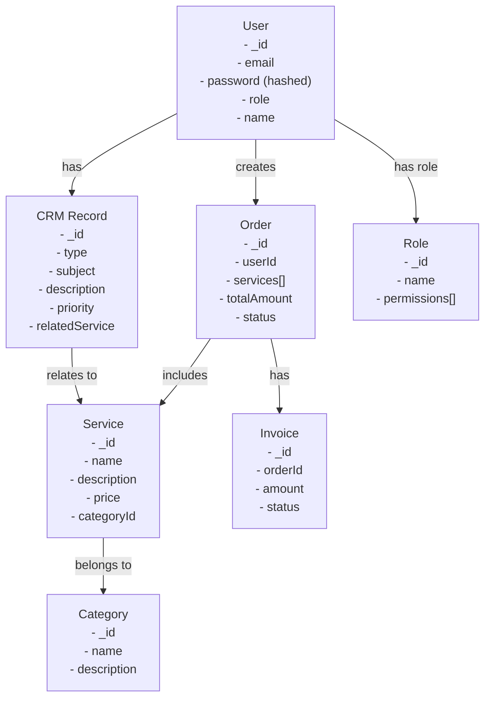

# VisionCraft Database Schema Documentation

This document outlines the database schema and relationships between different entities in the VisionCraft system.

## Entity Relationship Diagram

## Schema Relationships

### User
- Has many Orders (one-to-many)
- Has many CRM Records (one-to-many)
- Has one Role (one-to-one)

### Service
- Belongs to one Category (many-to-one)
- Included in many Orders (many-to-many)
- Referenced in many CRM Records (one-to-many)

### Order
- Belongs to one User (many-to-one)
- Has many Services (many-to-many)
- Has one Invoice (one-to-one)

### CRM Record
- Belongs to one User (many-to-one)
- Can reference one Service (many-to-one)

### Category
- Has many Services (one-to-many)

## Key Features

1. **User Management**
   - Secure password hashing
   - Role-based access control
   - Authentication using JWT

2. **Service Organization**
   - Hierarchical category structure
   - Detailed service information
   - Price management

3. **Order Processing**
   - Multiple services per order
   - Automatic invoice generation
   - Order status tracking

4. **Customer Relationship Management**
   - Issue tracking
   - Service-related inquiries
   - Priority-based handling

This schema design supports the core functionalities of VisionCraft while maintaining data integrity and efficient relationships between different entities.